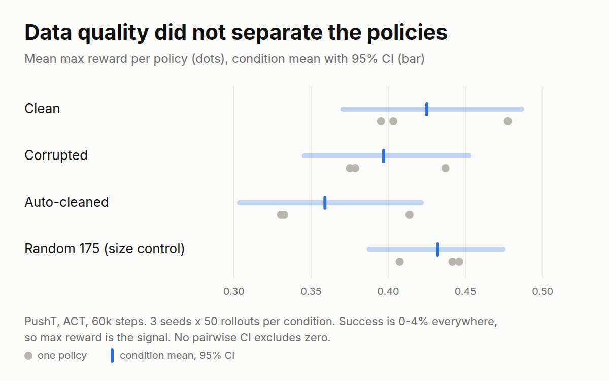

# DemoDoctor

Find bad robot demonstrations automatically, and measure what they cost a policy.

## The problem

Robot-learning teams say data quality matters more than model size, but controlled measurements are rare. This project injects known faults into clean demonstrations, detects them from signals alone, then measures policy success in simulation on clean vs corrupted vs auto-cleaned data.

## Faults

| Fault | What it mimics |
|---|---|
| `lag` (1–3 frames) | Slow camera pipeline |
| `stall` | Teleop freeze |
| `jitter` | Shaky teleoperation |
| `truncation` | Episode cut before success |
| `drop_frames` | Dropped/duplicated frames |

## Detectors (label-free)

| Detector | Target | Result |
|---|---|---|
| Stall runs | Teleop freeze | **F1 0.867** |
| Jitter vs filtered baseline | Shaky teleop | **F1 0.687** |
| Stable lag XCorr | Camera delay | F1 0.119 (honest null — flat landscape) |
| Length outlier | Truncation | F1 ~0 (honest null — variance swamps cuts) |
| Exact duplicates | Stuck camera | Null (re-encoding confound, explained) |

Cleaning rule (fixed before policy results): drop stall/jitter-flagged episodes → 175/206 kept, 26/31 dropped truly faulty (84% cleaning precision).

## Policy experiment: a null result

ACT policies on PushT, 60k steps, batch size 32, 3 seeds per condition, 50 rollouts per policy (`lerobot-eval`, batch size 1). Four data conditions: **clean** (all 206 episodes), **corrupted** (30% of episodes carry an injected fault), **auto-cleaned** (175 episodes kept by the stall/jitter rule above), and **random 175** (175 random episodes of the corrupted set, the size-matched control that separates "less data" from "better data").

| Condition | Policies | Success rate | Mean max reward [95% CI] |
|---|---|---|---|
| Clean | 3 | 0.7% | 0.425 [0.369, 0.488] |
| Corrupted | 3 | 1.3% | 0.397 [0.344, 0.454] |
| Auto-cleaned | 3 | 0.0% | 0.359 [0.302, 0.423] |
| Random 175 | 3 | 0.0% | 0.432 [0.386, 0.476] |

Pairwise differences in mean max reward (bootstrap over policies, then rollouts):

| A − B | Difference | 95% CI |
|---|---|---|
| clean − corrupted | +0.028 | [−0.050, +0.108] |
| corrupted − auto-cleaned | +0.038 | [−0.045, +0.119] |
| auto-cleaned − random 175 | −0.073 | [−0.147, +0.006] |
| corrupted − random 175 | −0.035 | [−0.105, +0.039] |
| clean − auto-cleaned | +0.066 | [−0.019, +0.152] |

**No pairwise interval excludes zero, so this grid shows no effect of corruption, of cleaning, or of data size.** The point estimates run the "wrong" way for cleaning (auto-cleaned is lowest), but they are inside the noise. The grid cannot resolve differences smaller than about 0.08 in mean max reward.

What limits it:

- **Floor effect.** Success is 0–4% in every cell (at most 2 of 50 rollouts), so mean max reward is the only usable signal and it is coarse.
- **Evaluation noise.** Re-evaluating the same checkpoint (50 rollouts again) moved mean max reward by 0.014 on average and by up to 0.037 (7 checkpoints; `results/eval_repeatability.txt`); the success rate changed for 2 of the 7. That is the size of the smaller condition gaps.
- **Three seeds.** Each policy takes about 2 hours on an RTX 3060, so n = 3 per condition was the budget.
- **Mixed training environments.** Some of the original grid runs were trained on rented pods. The `corrupted` and `cleaned` seed-2 policies were retrained locally (LeRobot 0.6.1, 60k steps, batch size 32, seed 2) after their pod checkpoints were lost; their original evaluations (0.373 and 0.349) were close to the retrained ones (0.379 and 0.331).

Untested explanations for the null: the policies barely solve PushT at this budget (floor effect), and the faults the detectors can find (stalls, jitter) may be mild for ACT's action chunking. Settling it would take more seeds, a longer training budget or a task metric with headroom, and faults large enough to hurt.

Reproduce: `python scripts/eval_all.py` (writes `outputs/eval_labelled/<condition>_s<seed>/eval_info.json`), `python scripts/final_table.py` (the tables above), `python scripts/eval_repeatability.py`, `python scripts/make_chart.py` (the figure). Committed snapshots of every number cited here, including the 12 per-policy `eval_info.json` files, are in `results/`; policies and videos are not committed.

## Status

Injector + detectors: 37 tests green. Corrupted and cleaned datasets on HF. Policy grid complete (12 policies, 600 rollouts): null result, reported above.

## Limitations

- Injected faults are easier than real teleoperation faults; detector F1 on injected faults says nothing about real-world fault performance.
- PushT only, ACT only, one training budget (60k steps).
- Underpowered grid (3 seeds per condition, floor-level success); see the policy section for what it can and cannot resolve.
- A data-quality study by an ML engineer learning robotics, not robotics expertise.

## License

MIT
